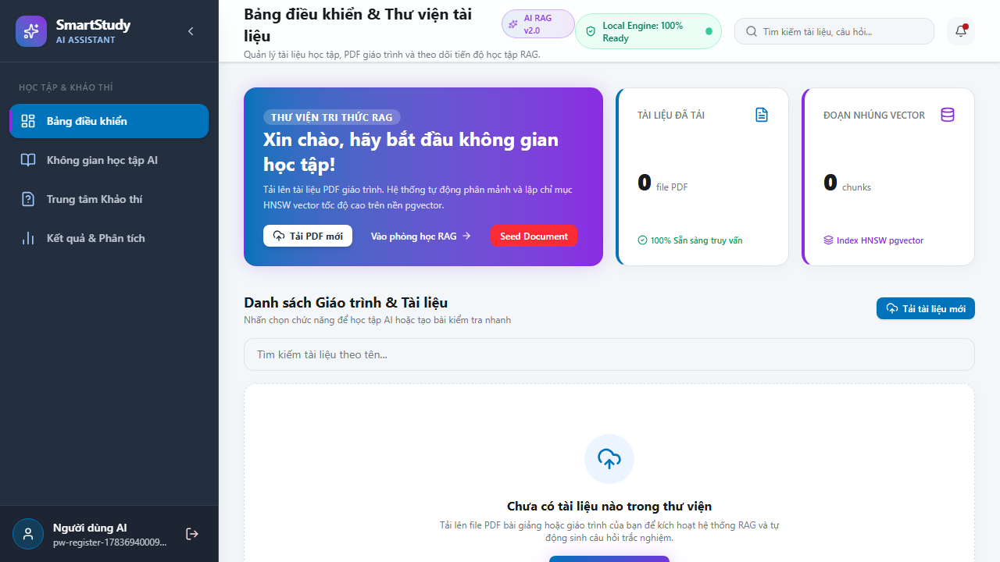
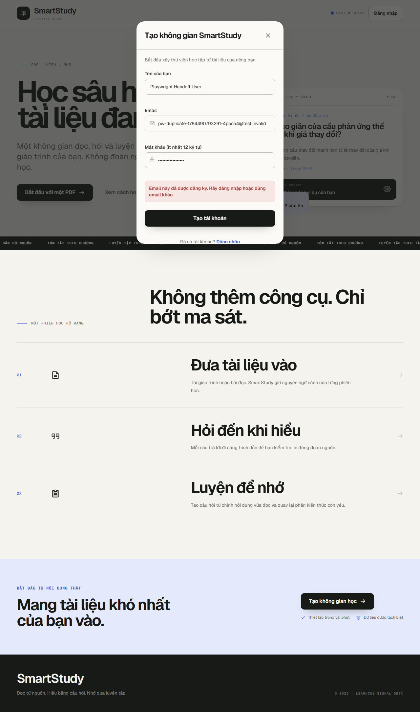
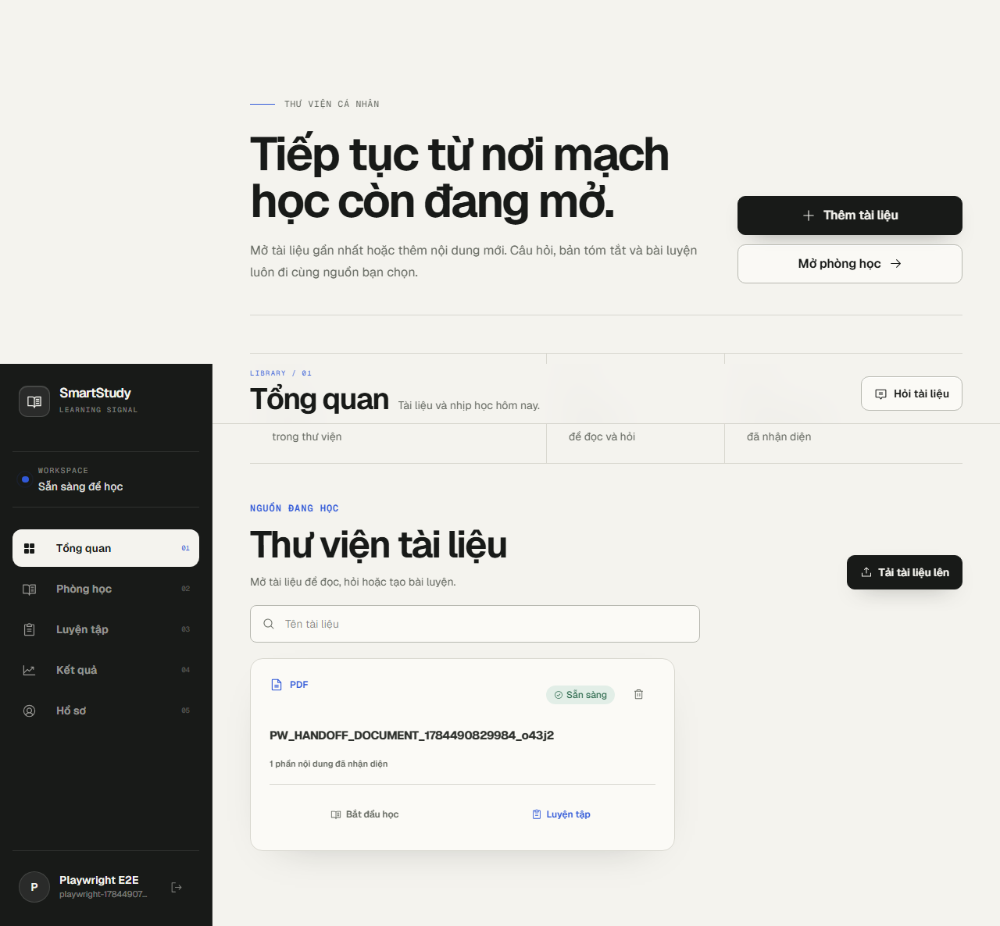
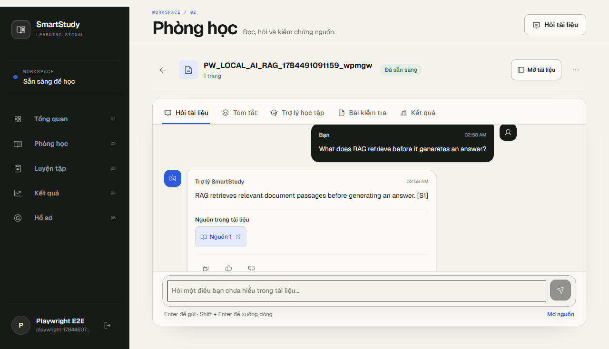
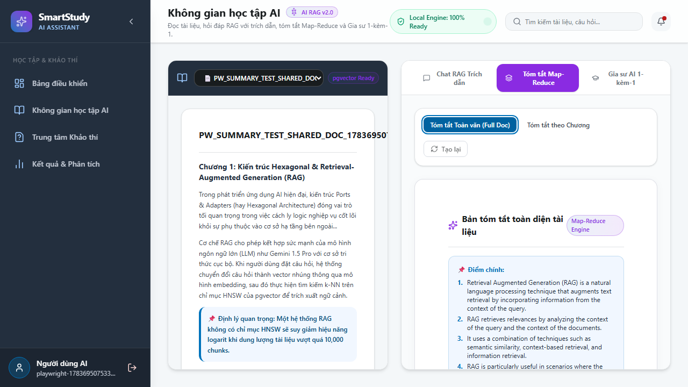
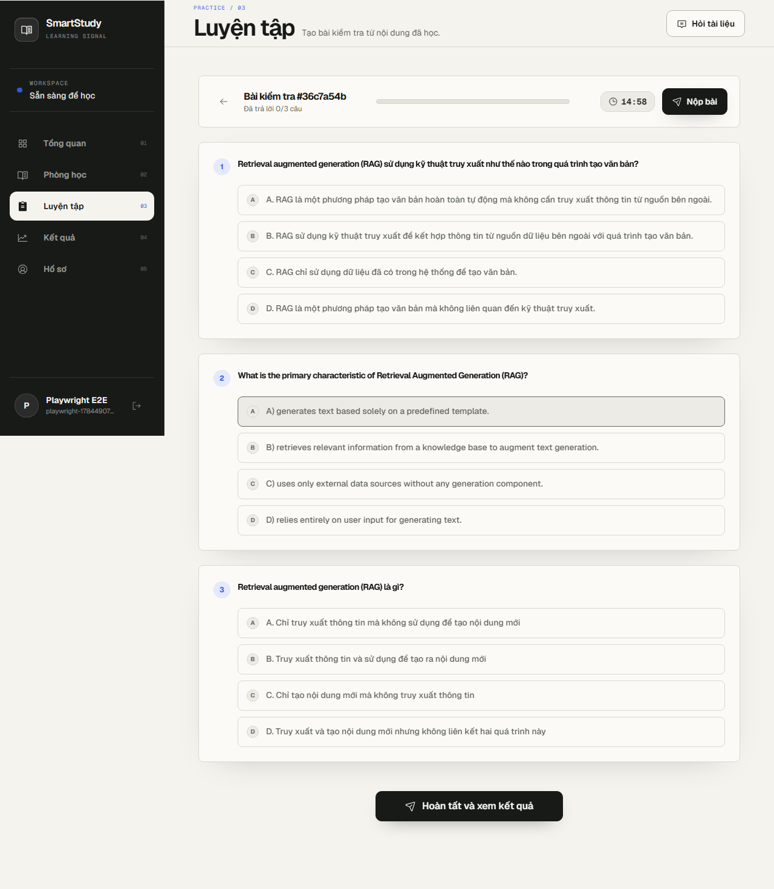
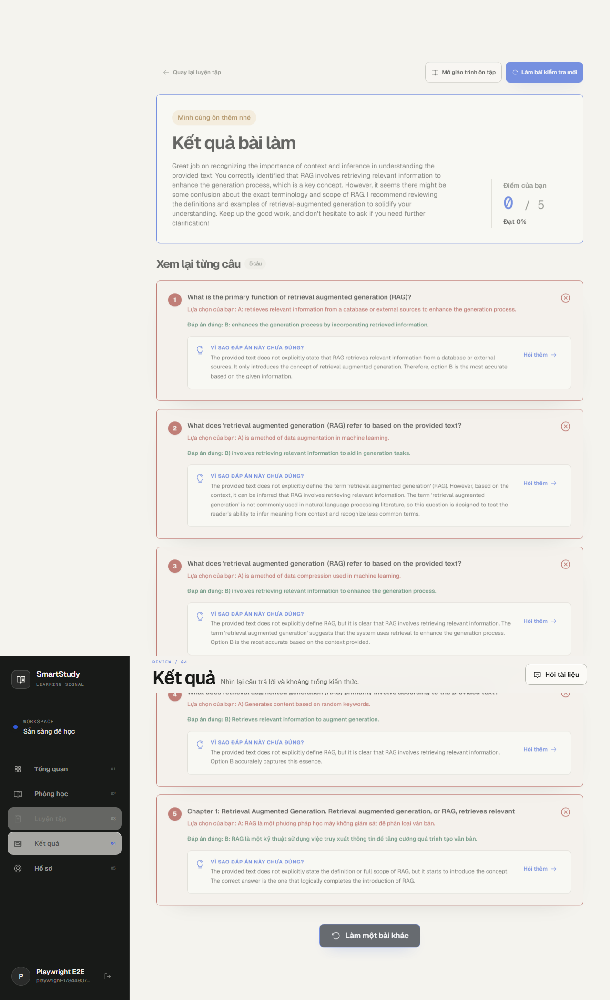

# Báo cáo kiểm thử bàn giao — SmartStudy AI

**Ngày kiểm thử:** 2026-07-10
**Môi trường:** Docker Compose local, frontend `http://localhost:8080`, API `http://localhost:3000`, llama.cpp + Qwen2.5 0.5B Q4
**Công cụ:** Playwright 1.61, Chromium và Firefox; backend Vitest/coverage trong CI.

## 1. Tóm tắt điều hành

Các luồng Auth, Documents, Chat/RAG, Summary, Tutor và Exam/Grading đã được chạy qua giao diện thật với Docker và local AI, có ảnh bằng chứng kèm theo. CI của các PR test đã pass lint, typecheck, test và build.

**Chưa đủ điều kiện xác nhận bàn giao trọn vẹn:** Quiz hiện có lỗi lặp lại với local model nhỏ: sau khi backend đã chặn 4 lựa chọn trùng, llama.cpp vẫn có thể sinh output không hợp lệ sau các retry và API trả `502`. Lỗi này được ghi nhận rõ ở mục 5; không đánh dấu Quiz là pass.

| Nhóm | Phạm vi | Trạng thái |
|---|---|---|
| A | Đăng ký, login, refresh, logout | PASS |
| B | Upload, validation loại/kích thước file, list/search/delete | PASS (targeted) |
| C | Chat RAG, citation, empty input, multi-turn | PASS |
| D | Summary full/chapter/cache | PASS |
| E | Quiz generation/grading | **FAIL — local LLM reliability** |
| F/G | Exam, answer-key security, grading/results | PASS (targeted) |
| H | Tutor with/without document context | PASS |
| Isolation / rate limit / resilience | Chưa chạy browser end-to-end trong đợt này |

## 2. Môi trường và cách chạy lại

```bash
cd D:\SmartStudyAI
docker compose up -d --build

cd frontend
npm install
npx playwright test --config=e2e/playwright.config.ts
```

Chạy nhanh từng nhóm:

```bash
npx playwright test --config=e2e/playwright.config.ts tests/auth-handoff.spec.ts
npx playwright test --config=e2e/playwright.config.ts tests/documents-handoff.spec.ts
npx playwright test --config=e2e/playwright.config.ts tests/local-ai-chat-tutor.spec.ts
npx playwright test --config=e2e/playwright.config.ts tests/summary-generation.spec.ts
npx playwright test --config=e2e/playwright.config.ts tests/exam-generation.spec.ts --grep "TC5.3|TC5.4"
```

Sau khi rebuild `api`, cần recreate frontend để nginx nhận lại upstream Docker:

```bash
docker compose up -d --force-recreate frontend
```

## 3. Test matrix và kết quả thực tế

| ID | Ca kiểm thử | Browser | Kết quả / bằng chứng |
|---|---|---|---|
| A1 | Đăng ký, lưu token, redirect dashboard, không lưu password | Chromium + Firefox | PASS |
| A2 | Chặn email trùng | Chromium + Firefox | PASS |
| A3 | Sai password 3 lần rồi login đúng | Chromium + Firefox | PASS |
| A4 | Refresh token và redirect khi refresh token mất | Chromium + Firefox | PASS |
| A5 | Logout xoá token client | Chromium + Firefox | PASS |
| B1 | Presign → MinIO PUT → complete → ready | Chromium + Firefox | PASS; 2,064ms / 1,622ms trong lần chạy evidence |
| B5a | Chặn file không phải PDF, không tạo upload URL | Chromium + Firefox | PASS |
| B5b | Chặn file >50 MiB phía client | Chromium + Firefox | PASS |
| C1 | Chat dựa PDF, citation đúng document | Chromium + Firefox | PASS |
| C2 | Câu hỏi ngoài tài liệu vẫn giữ citation thuộc document | Chromium + Firefox | PASS |
| C3 | Input rỗng không gọi message API | Chromium + Firefox | PASS |
| C4 | Multi-turn trong cùng conversation | Chromium + Firefox | PASS |
| D1 | Full summary + key points | Chromium + Firefox | PASS |
| D2 | Chapter summary | Chromium + Firefox | PASS |
| D3 | Cache summary | Chromium + Firefox | PASS; 9,335→51ms, 7,760→101ms |
| E1 | Quiz 3 câu, 4 lựa chọn khác nhau | Chromium | **FAIL: API 502** |
| F1 | Take-mode không lộ answer key | Chromium + Firefox | PASS |
| F3 | Submit, điểm, đáp án đúng và explanation | Chromium | PASS; 4 câu sai hiển thị kết quả |
| H1/H2 | Tutor có/không document context | Chromium + Firefox | PASS |

Các case Documents list/search/delete, Exam preset/progress/cancel và submit unanswered đã có trong các spec hiện hữu; nên chạy full suite lại sau khi xử lý Quiz trước khi chốt bàn giao khách hàng.

## 4. Ảnh bằng chứng

### Xác thực





### Tài liệu và RAG





### Tóm tắt, đề thi và chấm điểm







Toàn bộ ảnh Chromium/Firefox nằm trong `docs/test-evidence/`.

## 5. Lỗi/giới hạn đã phát hiện

### E-01 — Quiz local AI có thể thất bại với 502

**Mức độ:** High (chặn luồng Quiz)
**Cách tái hiện:** chạy `TC4.1` trong `frontend/e2e/tests/quiz-generation.spec.ts` trên Docker local AI.
**Quan sát:** Qwen2.5 0.5B đôi khi tạo các lựa chọn trùng. Backend hiện từ chối đúng theo rule “4 lựa chọn phải khác nhau”; sau các retry, endpoint trả `502`.
**Đã xử lý một phần:**

- PR #33: schema từ chối lựa chọn trùng và có regression unit test.
- PR #34: thay đổi nhiệt độ ở từng retry để tránh lặp output y hệt.

**Kết quả retest:** vẫn tái hiện `502` với fixture Quiz giàu nội dung. Không dùng mock hoặc bỏ validation để che lỗi.
**Khuyến nghị trước bàn giao:** dùng model local mạnh hơn hoặc bổ sung bước sinh/kiểm chứng distractor riêng, sau đó chạy lại toàn bộ Module E.

### Hạn chế phạm vi đợt test

- Chưa có browser E2E cho isolation hai user, rate limit 200 request/phút và resilience khi tắt MinIO/Redis/network.
- Không có màn hình quản lý profile riêng trong UI hiện tại; chỉ kiểm chứng đăng ký/session/logout.

## 6. Kết luận bàn giao

Không nên xác nhận **bàn giao hoàn toàn** cho tới khi E-01 được khắc phục và chạy full Playwright suite. Các module PASS trong bảng có thể demo/bàn giao kèm ảnh evidence này; Quiz cần được ghi rõ là chưa sẵn sàng trong biên bản với khách hàng.
